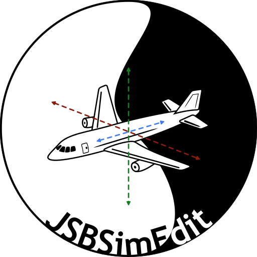

<div>
<p align="center">
    
</p>

<p align="center">
    <a href="https://github.com/utastudents/jsbsimedit/releases/lastest">
        
    </a>
    <a href="https://github.com/utastudents/jsbsimedit/issues">
        
    </a>
    <a href="https://github.com/utastudents/jsbsimedit/releases">
        
    </a>
    <a href="https://github.com/utastudents/jsbsimedit/blob/main/LICENSE">
        
    </a>
</p>

# JSBSimEdit
JSBSimEdit is the spiritual successor to [JSBSimCommander](https://github.com/JSBSim-Team/jsbsimcommander). Written in C++17 and targets MacOS, Windows, and Linux.

### Building
#### Linux
- [CMake 3.25.1+](https://cmake.org/)
- Clang 17+ or GCC 13+
- gtkmm 4.10+

> **Warning**
> Ubuntu 22.04 may not have libgtkmm-4.0-dev in the apt get repository. The recommend action is to use 24.04 if possible.
##### Steps
1. Download clang++ ```sudo apt install clang++``` or g++ ```sudo apt install g++```
2. Download cmake ```sudo apt install cmake```
3. Download gtkmm ```sudo apt install libgtkmm-4.0-dev```
4. Clone source ```git clone https://github.com/utastudents/jsbsimedit.git```
5. cd into directory and generator build files ```cmake --preset Linux-x64-GCC-Debug .``` make sure to note if you are using clang or gcc, you will need to change the preset
6. Use CMake to build ```cmake --build out/build/Linux-x64-GCC-Debug```
#### Windows
Building on Windows Requires the following. Clang tooling is optional if you don't want to target llvm, the cl compiler will work just fine.
- [Visual Studio 2022 community or VS build tools](https://visualstudio.microsoft.com/vs/community/)
- [Visual Studio 2022 Clang Tooling](https://learn.microsoft.com/en-us/cpp/build/clang-support-msbuild?view=msvc-170)
- [CMake 3.25.1+](https://cmake.org/)
- gtkmm 4.10+
- pkgconf
##### Steps
###### Visual Studio route
1. Download Visual Studio 2022 community edition or download just the build tools if using another IDE.
2. Download the Clang tooling for VS22 if targeting llvm.
3. Download CMake 3.25.1 or greater.
4. ```git clone https://github.com/utastudents/jsbsimedit.git```
5. Open the directory with VS22, vcpkg should start downloading the dependencies once configuring the CMakefile.
6. In the Configure Present Dropdown list, select either "Windows-x64-Clang-Debug" or "Windows-x64-Debug".
7. Visual Studio should have built the build files from CMake after selecting the present, if not, manually generate them in the menu bar.
8. Build the present. Build > Build all (F7)
###### CLI route
1. Download Visual Studio 2022 community edition or download just the build tools if using another IDE.
2. Download the Clang tooling for VS22 if targeting llvm.
3. Download CMake 3.25.1 or greater.
4. Open the Developer PowerShell for VS 2022
5. ```git clone https://github.com/utastudents/jsbsimedit.git```
6. cd to the cloned directory
7. Generate build files ```cmake --preset Windows-x64-Clang-Debug .```
8. Use CMake to build ```cmake --build out/build/Windows-x64-Clang-Debug```

#### MacOS
- [Homebrew](https://brew.sh/)
- [Xcode developer tools](https://developer.apple.com/xcode/)
- [CMake 3.25.1+](https://cmake.org/)
- gtkmm 4.10+
##### Steps
1. Download homebrew ```/bin/bash -c "$(curl -fsSL https://raw.githubusercontent.com/Homebrew/install/HEAD/install.sh)"```
2. Download and install Xcode, or just the developer tools.
3. Download and install [CMake](https://cmake.org/download/) for MacOS.
4. Downoad gtkmm ```brew install gtkmm4```
5. Clone source ```git clone https://github.com/utastudents/jsbsimedit.git```
6. cd into directory and generator build files ```cmake --preset MacOS-Arm64-Clang-Debug .```
7. Use CMake to build ```cmake --build out/build/MacOS-Arm64-Clang-Debug```

##### To run on linux:
1. cd out/build/Linux-x64-GCC-Debug/
2. ./JSBSimEdit 

